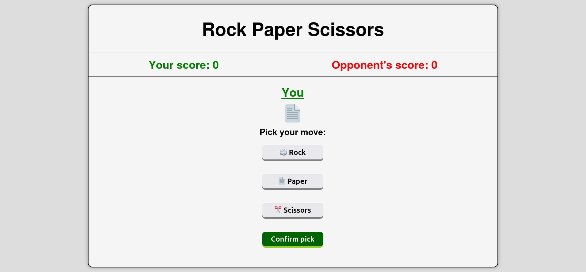
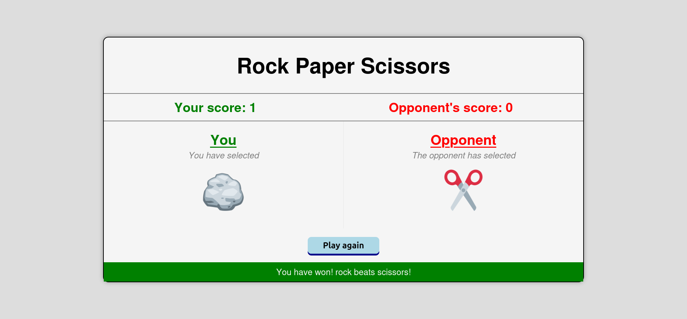

# Rock Paper Scissors

This repositories contain the solution for the Rock Paper Scissors project found on [The Odin Project](https://www.theodinproject.com/lessons/foundations-rock-paper-scissors). The original project is intended to be a console game, but this one includes GUI elements such as buttons and images for more convenience.

## Features

The app recreates the classic game of [Rock paper scissors](https://en.wikipedia.org/wiki/Rock_paper_scissors), and allows the player to play against the computer that picks a random move each time.

The game also keeps track of the scores earned by both the player and the opponent. Scores are awarded to the player who plays a winning hand against their opponent (*such as a player who gets to pick rock against a player who picks scissors*). A tie results when both players pick the same hand, in which case no points will be awarded to either player.

The game's algorithm works in the following way:

+ At the start of the game, the game prompts the user by selecting a move (*rock, paper, or scissors*). The player is able to preview their selection before confirming their pick.
+ After confirming the pick, the opponent proceeds to make a random pick.
+ The preview of both hands are shown side by side, and a winner is determined based by whoever has the winning hand.
+ The scores are updated depending on whoever won the last round. (**NOTE: If the last round ended in a tie, then no points are rewarded to either player**)
+ A restart button appears to play a new round.

## Preview

Here are some screenshots of the game in action.

*Hand selection menu*

*Main round screen*

### Credits

Huge thanks for [The Odin Project](https://www.theodinproject.com/) once again for giving me the opportunity to learn for free.
